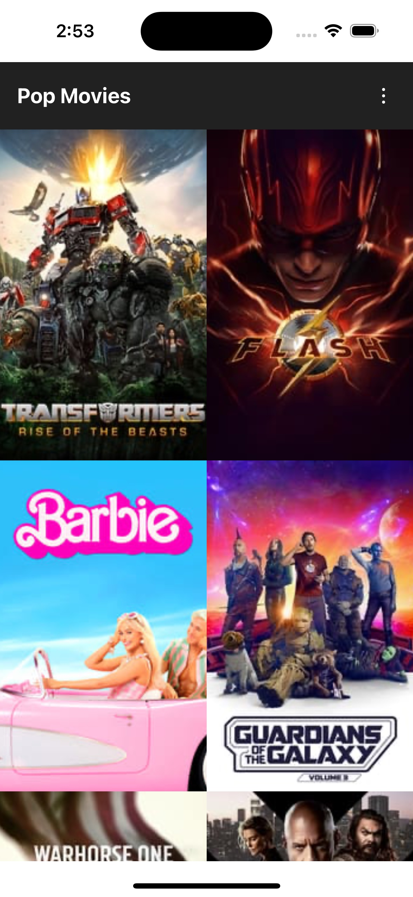
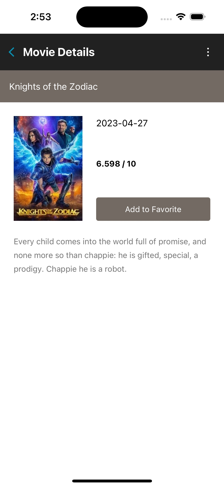

# MovieApp

This is a simple project for searching movies and checking the details.

## Main libraries

- [React Native 0.72](https://reactnative.dev/docs/getting-started)
- [TypeScript](https://www.typescriptlang.org/docs/handbook/typescript-in-5-minutes.html)
- [React Navigation](https://reactnavigation.org/docs/getting-started/)
- [React Query](https://tanstack.com/query/v4/docs/react/overview)
- [NativeBase](https://docs.nativebase.io/getting-started)
- [React Native Testing Library](https://testing-library.com/docs/react-native-testing-library/intro/)

## Screenshots




## Setting Up Environment

1. Follow [this](https://reactnative.dev/docs/environment-setup) guide for first steps including device/emulator setup
   - Make sure to install [Watchman](https://facebook.github.io/watchman/docs/install)
2. In VSCode install the following extensions for our linting rules:
   - [Prettier](https://marketplace.visualstudio.com/items?itemName=esbenp.prettier-vscode)
   - [ESLint](https://marketplace.visualstudio.com/items?itemName=dbaeumer.vscode-eslint)
   - [React Native Tools](https://marketplace.visualstudio.com/items?itemName=msjsdiag.vscode-react-native) _This is required to debug app and use env files_
3. Clone the repo then run `npm ci` or `yarn install` in your terminal in the root directory of the project
4. In ios folder, run `pod install` or `pod update` in your terminal.
5. If you don’t already have an account on [TMDB](https://developer.themoviedb.org/reference/intro/getting-started), you will need to create one in order to request an API Key.
6. Open duplicate `.env.example` then rename the duplicate to `.env` with adding your TMDB API key as API_KEY like `API_KEY=xxxxxxxxxxxxxxxxxxxxx`.
   Important: Clear build cache whenever you change env file.

## Start the Metro Server

First, you will need to start **Metro**, the JavaScript _bundler_ that ships _with_ React Native.

To start Metro, run the following command from the _root_ of your React Native project:

```bash
# using npm
npm start

# OR using Yarn
yarn start
```

## Start your Application

Let Metro Bundler run in its _own_ terminal. Open a _new_ terminal from the _root_ of your React Native project. Run the following command to start your _Android_ or _iOS_ app:

### For Android

```bash
# using npm
npm run android

# OR using Yarn
yarn android
```

### For iOS

```bash
# using npm
npm run ios

# OR using Yarn
yarn ios
```

If everything is set up _correctly_, you should see your new app running in your _Android Emulator_ or _iOS Simulator_ shortly provided you have set up your emulator/simulator correctly.

This is one way to run your app — you can also run it directly from within Android Studio and Xcode respectively.

# Troubleshooting

If you can't get this to work, see the [Troubleshooting](https://reactnative.dev/docs/troubleshooting) page.

# Learn More

To learn more about React Native, take a look at the following resources:

- [React Native Website](https://reactnative.dev) - learn more about React Native.
- [Getting Started](https://reactnative.dev/docs/environment-setup) - an **overview** of React Native and how setup your environment.
- [Learn the Basics](https://reactnative.dev/docs/getting-started) - a **guided tour** of the React Native **basics**.
- [Blog](https://reactnative.dev/blog) - read the latest official React Native **Blog** posts.
- [`@facebook/react-native`](https://github.com/facebook/react-native) - the Open Source; GitHub **repository** for React Native.
